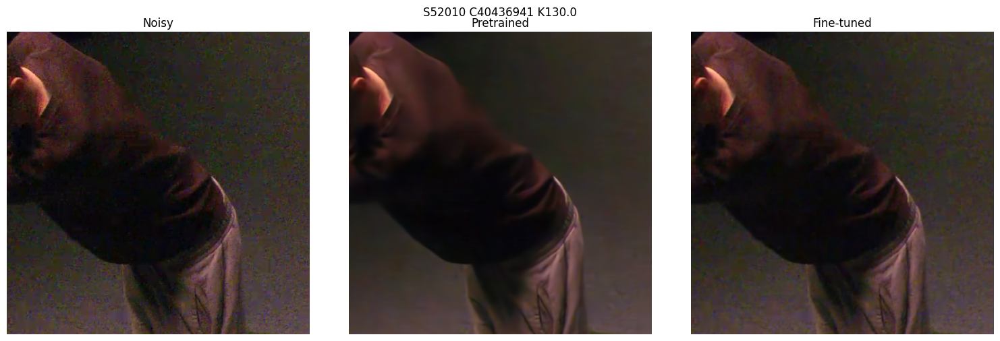

# Sölvi Santos

I work with machine learning and numerical methods, and I'm building tools for learning maths. My background is in computer science and mathematics at the University of Iceland.

<picture>
  <source media="(prefers-reduced-motion: reduce)" srcset="assets/contributions-static.svg">
  <source media="(prefers-color-scheme: dark)" srcset="assets/contributions-dark.svg">
  
</picture>

[Static view](assets/contributions-static.svg)

## Currently building

**Ratatoskur** is an iPad maths notebook I'm building with Jóhannes Reykdal Einarsson and Sævar Breki Snorrason. Students write with Apple Pencil and can ask for a hint, check a step or see a worked solution in Icelandic. Teachers can assign exercises and review the work students submit.

Watch a short lesson

<picture>
  <source media="(prefers-reduced-motion: reduce)" srcset="assets/ratatoskur-static.svg">
  <source media="(prefers-color-scheme: dark)" srcset="assets/ratatoskur-dark.svg">
  
</picture>

A scripted example based on the prototype. [Static view](assets/ratatoskur-static.svg).

A misread handwritten symbol can change the problem, so the app asks for clarification when the reading is uncertain. Students can keep writing, save their notebook and return to earlier attempts. The app uses SwiftUI and PencilKit, with a FastAPI backend. It's still a prototype; handling unclear handwriting and keeping the feedback connected to the student's actual work are ongoing parts of it.

[iOS app](https://github.com/solvisantos22/ratatoskur_ios) · [Backend](https://github.com/solvisantos22/ratatoskur_backend) · [Interactive walkthrough](https://solvi-lab.solvisantos.chatgpt.site/#ratatoskur)

## ELVA video denoising

For my ELVA project, I evaluated FastDVDnet and SwinIR on multi-camera video recorded at 250 to 400 FPS. The footage contained noise, clipping and compression artifacts. There was no clean reference recording to compare against, which made evaluating the results difficult.

I tested and fine-tuned denoising models, including self-supervised approaches, and compared image quality, runtime and compression efficiency. The question was how much useful detail could be recovered, and at what computational cost. The experiments and results are in my [final report](https://github.com/solvisantos22/ElvaReport).

Noisy input, pretrained FastDVDnet, then the same model after fine-tuning. This crop from the report shows the tradeoff between removing noise and preserving texture.

## Réttarvísir

Jóhannes and I built [Réttarvísir](https://github.com/solvisantos22/maltaekni_lokaverkefni), an Icelandic consumer-rights retrieval prototype for an NLP course. It retrieves passages from selected laws, uses them to answer questions and shows the supporting citations. We compare BM25 with embedding search, combinations of the two through reciprocal rank fusion, and reranking.

Icelandic inflection and the difference between everyday questions and legal wording make retrieval less straightforward. We used a fixed set of questions and a manual review interface to compare the retrieved passages and the answers built from them. The code and final report are in the repository.

## Romberg integration

In [Romberg](https://github.com/solvisantos22/Romberg), I compare two ways to integrate functions over a unit square: a rectangular grid with the trapezoidal rule, and a triangular mesh sampled at each triangle's centre. Both use Romberg-style extrapolation as the grid is refined. The Python experiments compare error and runtime on smooth and oscillatory functions, using SciPy integration as a numerical reference.

See the mesh refine

<picture>
  <source media="(prefers-reduced-motion: reduce)" srcset="assets/romberg-static.svg">
  <source media="(prefers-color-scheme: dark)" srcset="assets/romberg-dark.svg">
  
</picture>

[Interactive experiment](https://solvi-lab.solvisantos.chatgpt.site/#romberg) · [Code for this example](https://github.com/solvisantos22/Romberg/blob/master/romberg2.py) · [Static view](assets/romberg-static.svg)

I've also worked on data analysis and reporting within risk management at Íslandsbanki.

[LinkedIn](https://www.linkedin.com/in/s%C3%B6lvi-santos-226611264/) · [Email](mailto:solvisantos22@gmail.com)
